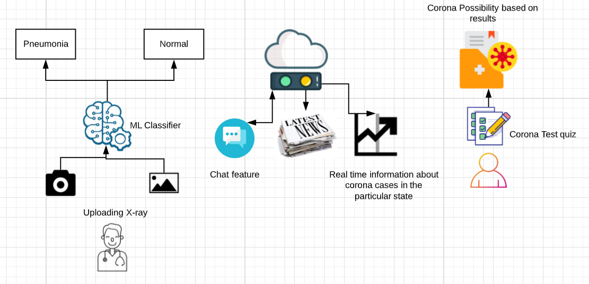

# covid-19-app 
<!-- TABLE OF CONTENTS --> 
## Table of Contents 
* [About the Project](#about-the-project) 
  * [Abstract](#abstract) 
* [How it works](#how-it-works) 

<!-- ABOUT THE PROJECT --> 
## Abstract 
Our main aim was to create an All-in-One Solution for helping people fight with Covid-19. Our solution is an Android application for common users as well as medical professionals Common users : Allows them to connect with the medical professionals via the chat feature. Through Web Scraping, app provides them with the latest updates on corona and state wise statistics. A Symptoms Test which as per the result of the choices selected by the user, estimates the probabilty of corona. Medical professionals : Due to shortage of highly qualified doctors to treat large number of patients affected due to Covid-19 Outbreak, ward boys are being trained in many hospitals to stabilize the load on Healthcare System. Hence, we have built an Xray classifier using ML toolkit in Firebase which just accepts the Posteroanterior (PA) view of chest xray image of the patient as an input and classifies it as pneumonia or normal. This will help the doctors and medical staff in detecting the disease by reducing the detection procedure to just uploading the Xray image in the App and getting the result. 
A video that displays the app layout and explains the same : https://drive.google.com/file/d/1Aj9ZLoo4r0l4vt2QS0uLCO0nfRpnignd/view?usp=drivesdk 

## How It Works 

Here's a flowchart explaining the process : 
  

